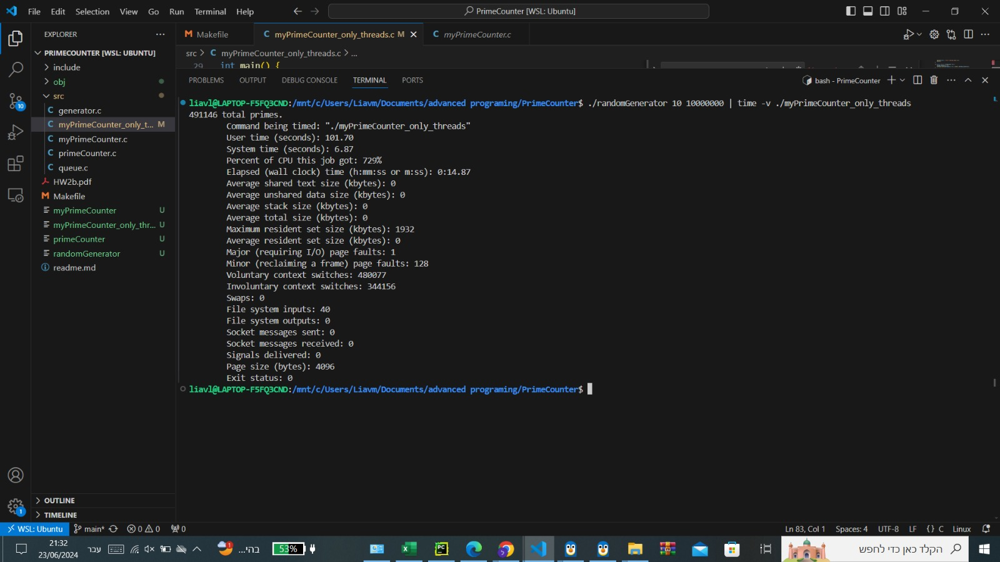
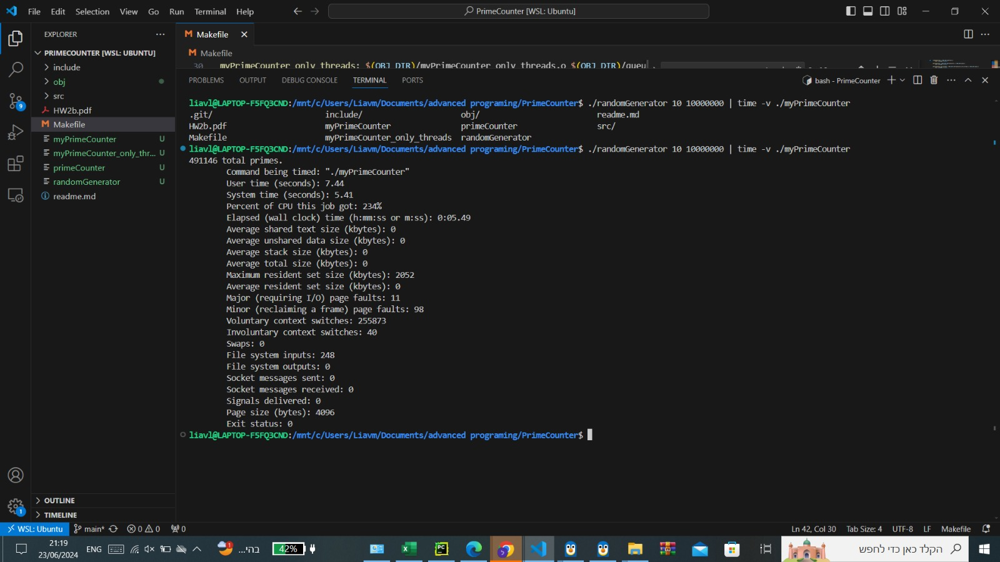

# Advanced Programing Ex2

## Random Prime Counter

### Introduction

In our assignment, we utilized a provided random number generator to simulate an endless stream of numbers.
Our task was to count the number of prime numbers within this stream.
To achieve this, we parallelized the process to fully utilize all CPU cores.
We also improved the isPrime function where necessary.
Importantly, we adhered to a strict memory usage limit of 2MB.

Note, the project requires a gcc compiler

### How To Run

- Clone project

```bash
  https://github.com/liavm1998/PrimeCounter.git
```

- To build the project
  `  make`
- To build and run the project
  `  make run`

- To clean up
  `  make clean`

- To run test
  `  make test`

## Running the Program

```bash
./randomGenerator 100 10000000 | ./primeCounter
```

## Running with Time Measurement

```bash
time ./randomGenerator 10 10000000 |  ./primeCounter
```

## Tests

we have built two tests.

1. Unit test for the isPrime function
2. Integration test which checks our logic and validates the expected prime numbers is equal to the expected number.
   The tests were built using cUnit package.

- To run tests
  `  make test`

## Performance Comparison

Their output:


Our output:


Our improved solution without improving the isPrime function



Our improved solution with improving the isPrime function



We can see that our output achieved a better score.
